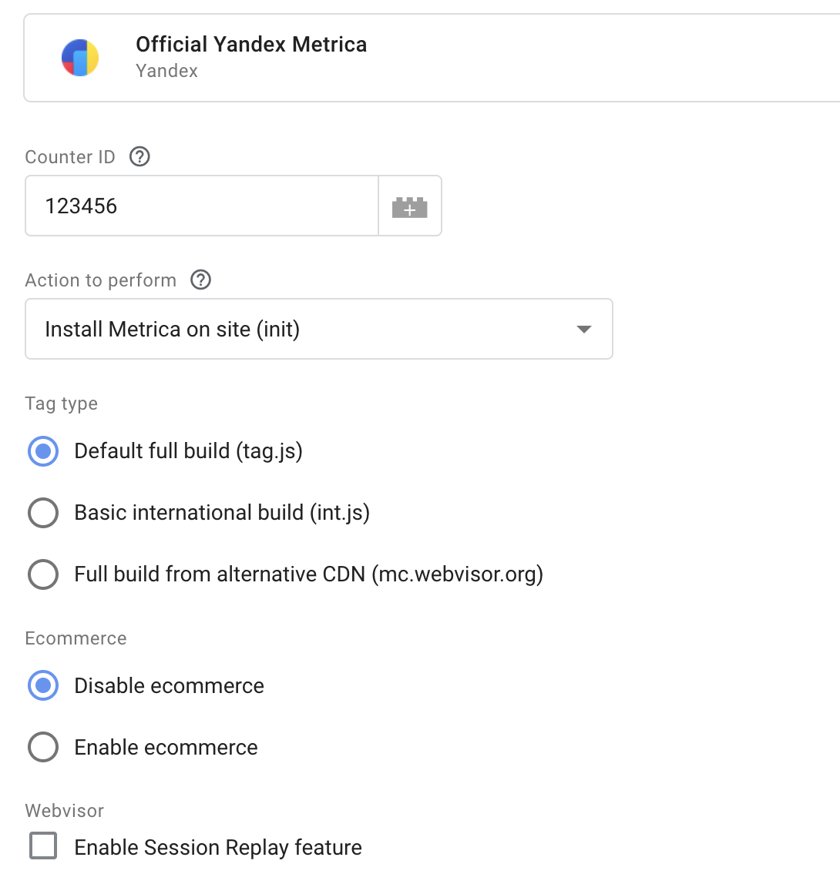
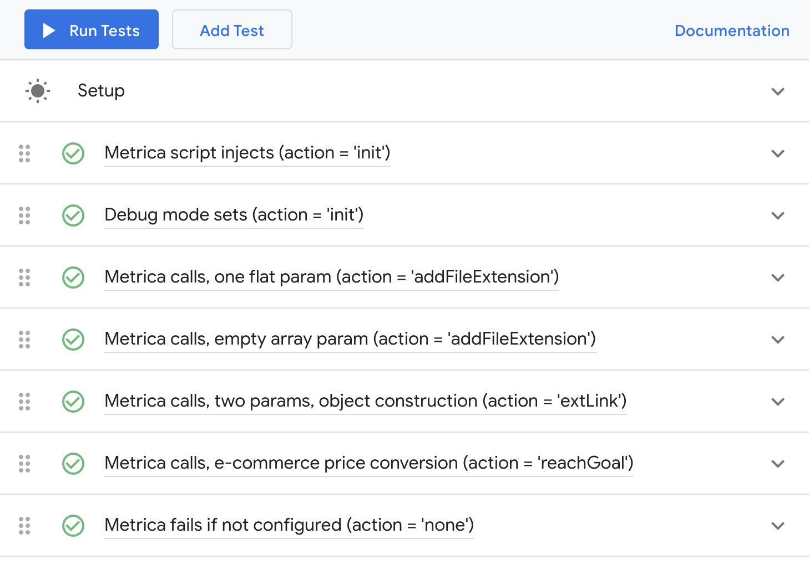

# Official Yandex Metrica template for GTM (Google Tag Manager)

This template adds the [Metrica Tag](https://github.com/yandex/metrica-tag) to your website. To ensure better analytics, trigger it during initialization.

</img>

### Supported methods

The template supports all methods from the Metrica JS API as outlined in the [official documentation](https://yandex.com/support/metrica/):

- [init](https://yandex.com/support/metrica/code/counter-initialize.html)
- [addFileExtension](https://yandex.com/support/metrica/objects/addfileextension.html)
- [extLink](https://yandex.com/support/metrica/objects/extlink.html)
- [file](https://yandex.com/support/metrica/objects/file.html)
- [firstPartyParams](https://yandex.com/support/metrica/objects/first-party-params.html)
- [firstPartyParamsHashed](https://yandex.com/support/metrica/objects/first-party-params-hash.html)
- [hit](https://yandex.com/support/metrica/objects/hit.html)
- [notBounce](https://yandex.com/support/metrica/objects/notbounce.html)
- [params](https://yandex.com/support/metrica/objects/params-method.html)
- [reachGoal](https://yandex.com/support/metrica/objects/reachgoal.html)
- [setUserID](https://yandex.com/support/metrica/objects/set-user-id.html)
- [userParams](https://yandex.com/support/metrica/objects/user-params.html)

### Features

- Simple mode for easy integration, and expert mode for accessing all functions and parameters.
- Execution of custom callback code from the template’s sandboxed JavaScript is not supported in GTM for security reasons.
- Configurable via parameters — no need for boilerplate universal code.
- Includes GTM tests to validate the template’s internal code.
- Debug mode to verify correct functionality and installation.

## For Developers

If you are Yandex employee please visit https://nda.ya.ru/t/20Cds6lt7ASopm for additional info about project

### How to submit a Pull Request

1. Fork the repository.
2. Import the `template.tpl` into your GTM interface.
3. Make your changes.
4. Run tests and write if neccesary.
5. Export the updated `template.tpl`.
6. Replace the existing file.
7. Accept the Yandex Contributor License Agreement (CLA).
8. Submit a Pull Request (PR).

</img>
